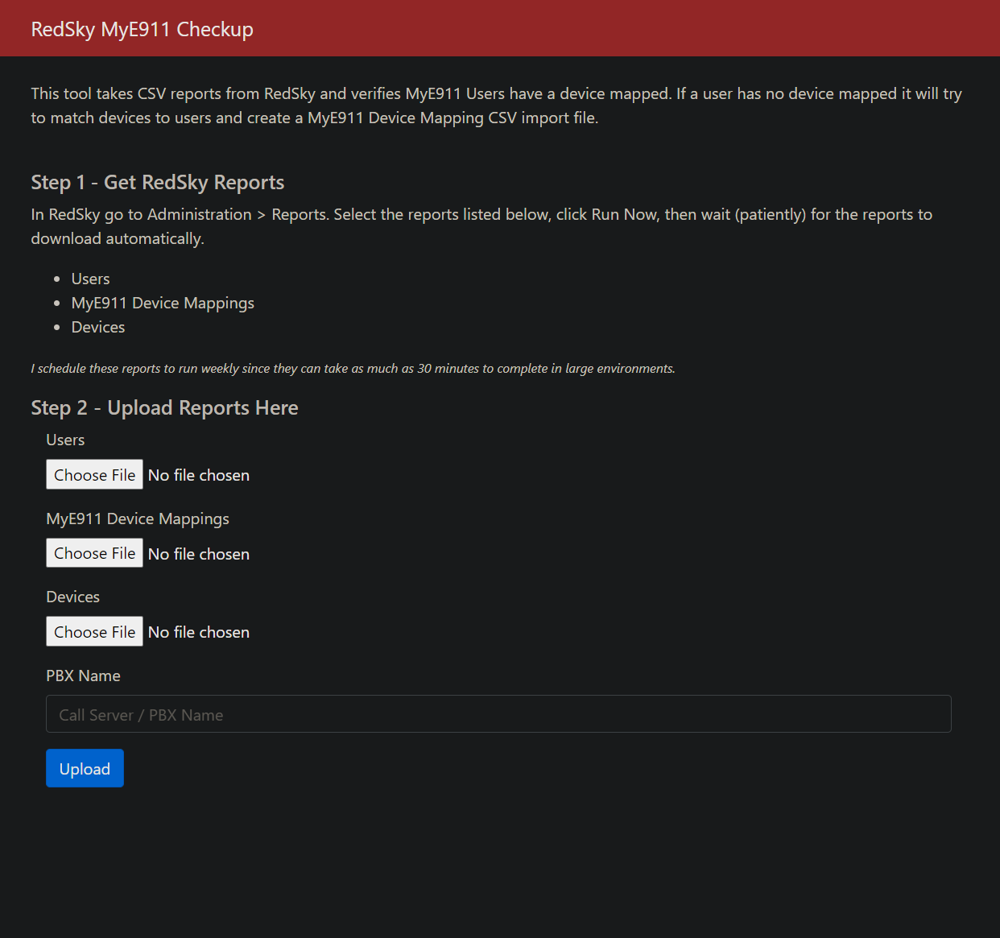
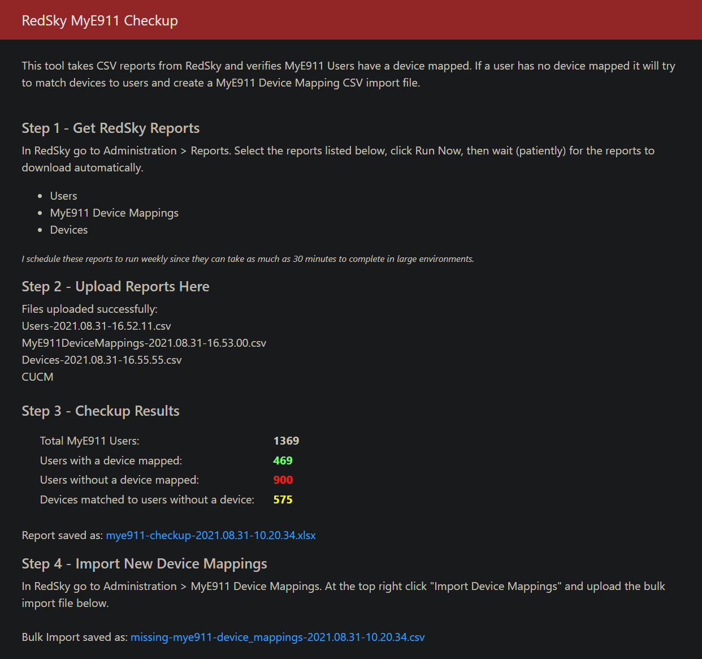

# RedSky MyE911 Checkup
Web GUI tool that takes CSV reports from RedSky and verifies MyE911 Users have a device mapped. If a user has no device mapped it will try to match devices to users and create a MyE911 Device Mapping CSV import file.

## Table of contents
- [Installation](#installation)
- [Setup](#setup)
- [Usage](#usage)
## Installation

## Setup

## Usage

